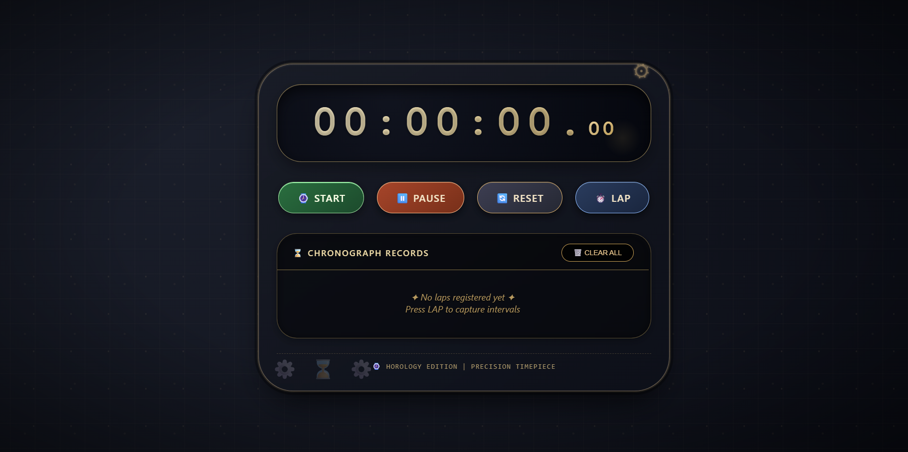
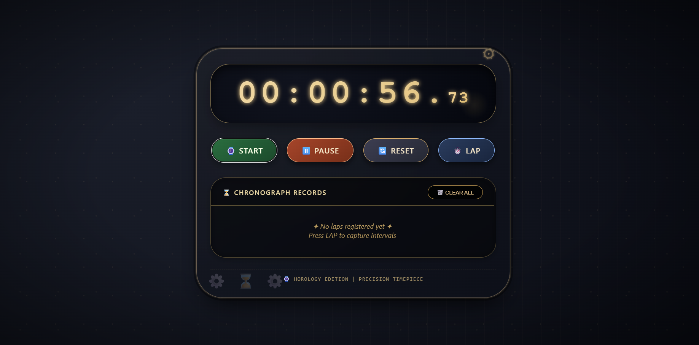
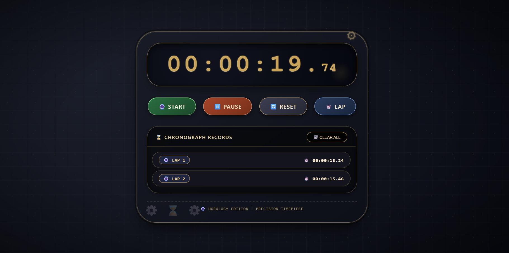
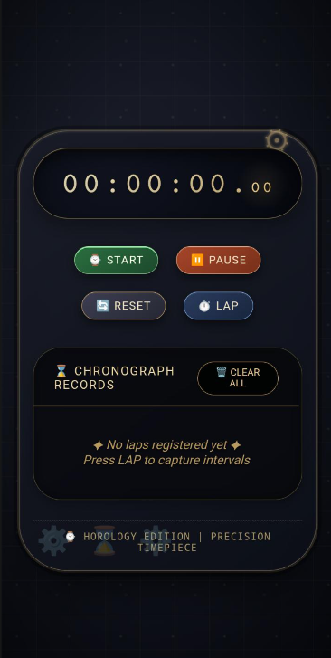

# ⏱️ Stopwatch Web App | Prodigy Infotech Task-02

## 📌 Overview
Premium watch-themed stopwatch with lap tracking, keyboard shortcuts, and glass-morphism design.

## ✨ Features
- ⏯️ Start / Pause / Reset
- 🏁 Record unlimited laps
- 🗑️ Clear all laps
- ⌨️ Keyboard: `Space` (Start/Pause), `R` (Reset), `L` (Lap), `C` (Clear)
- 📱 Fully responsive

## 🖼️ Screenshots

## 🚀 Live Demo
[View Live Demo]([https://YOUR-USERNAME.github.io/PRODIGY_WD_01](https://chaithanya8861.github.io/PRODIGY_WD_02/)
 
## 👨‍💻 Author
**Chaithanya** - Prodigy Infotech Intern
